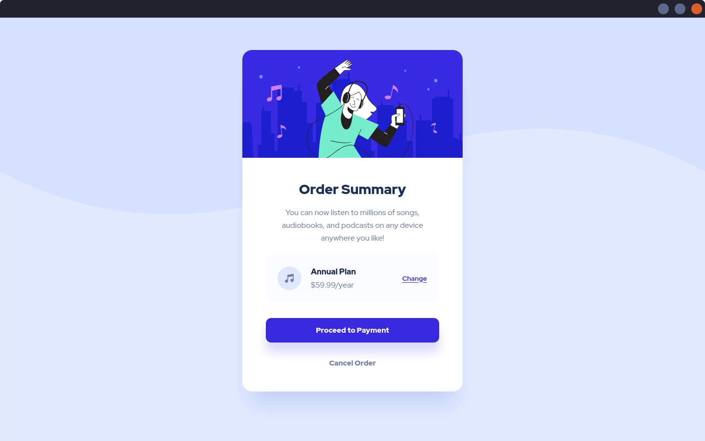

# Frontend Mentor - Order summary card

This is a solution to the [Order summary card challenge on Frontend Mentor](https://www.frontendmentor.io/challenges/order-summary-component-QlPmajDUj). 

## Links

- Solution URL: [GitHub](https://github.com/Michal-Majchrzak/fm-order-summary-component)
- Live Site URL: [GitHubPages](https://michal-majchrzak.github.io/fm-order-summary-component/)

## Preview

### Mobile

Uicons by [Flaticon](https://www.flaticon.com/uicons)

### Desktop

## Built with

- HTML5 markup
- Sass
- Responsive layout
- Mobile-first workflow

## Author

- Frontend Mentor - [@Michal-Majchrzak](https://www.frontendmentor.io/profile/Michal-Majchrzak)